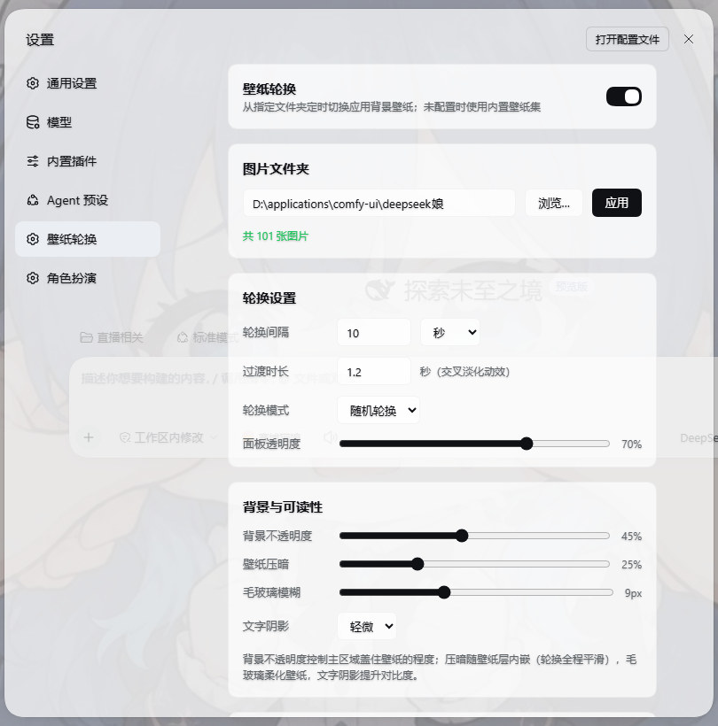
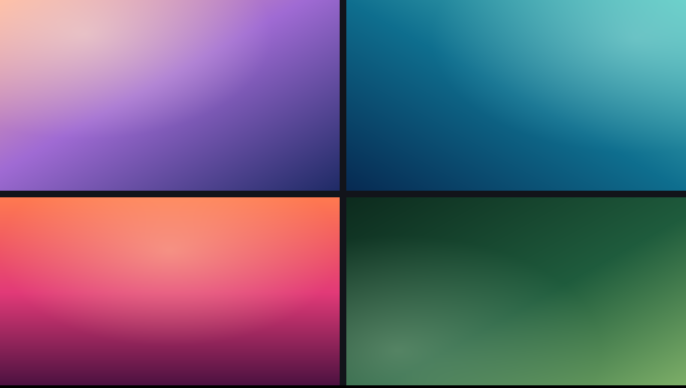
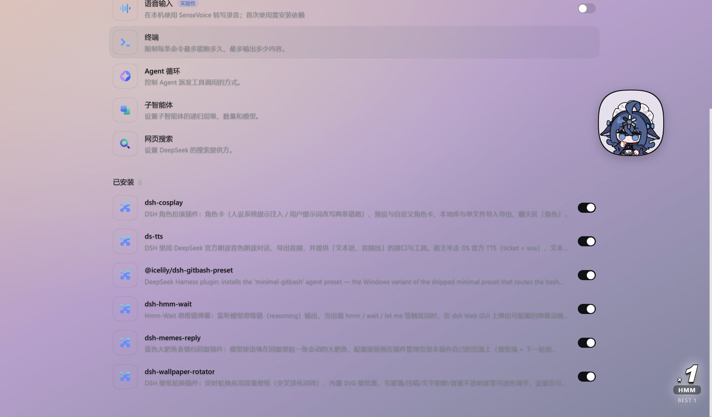

# DSH 壁纸轮换器 · 给应用背景定时换壁纸

> **English**: A DeepSeek Harness web plugin that rotates your app background wallpaper from a folder on a timer, with cross-fade transitions and readability controls.

[](LICENSE)
[](wallpaper-rotator/package.json)
[](https://github.com/topics/dsh-plugin)

指定一个图片文件夹，插件按你设的间隔把 DSH 的应用背景壁纸一张张换过去（带交叉淡化）；没配文件夹就用随插件分发的 4 张 SVG 渐变壁纸。因为壁纸铺在整个界面的最底层，插件同时给了三个可读性旋钮，让面板和文字在花哨的图上仍然看得清。


*实拍：「设置 → 壁纸轮换」面板（本机 DSH 实例）。图里的文件夹路径与 101 张图片是本机演示配置，不是默认值 —— 默认值是内置壁纸集。*

**它做四件事**：

| 你想干的事 | 插件怎么做 | 你看到的 |
| --- | --- | --- |
| 让背景每隔一阵换一张 | 每秒查一次到点没，到点就换（`< 2` 张图不换） | 壁纸按 10 分钟（可改）轮换，顺序或随机 |
| 换的时候别跳变 | 预加载新图 → 顶层淡入 → 旧图写入被盖住的底层 → 顶层淡出 → 清顶层 | 一次 1.2 秒的交叉淡化，收尾不闪 |
| 壁纸太花、字看不清 | 背景不透明度 / 壁纸压暗 / 毛玻璃模糊 / 文字阴影 | 三档可读性调节（见[下文](#readability)） |
| 不想配文件夹也想有背景 | 4 张内置 SVG 渐变壁纸随插件分发 | 打开就有壁纸在轮换 |

---

## 目录

| 想了解 | 看这里 |
| --- | --- |
| 怎么装、怎么跑起来 | [快速开始](#quickstart) |
| 有哪些开关、默认值是什么 | [配置参考](#config) |
| 三个可读性旋钮各自解决什么 | [可读性三件套](#readability) |
| 它到底怎么实现的 | [工作原理](#how) |
| 文件都放在哪 | [目录结构](#layout) |
| 出问题了怎么看 | [排障](#troubleshoot) |
| 有什么做不到的 | [已知限制](#limits) |
| 想改代码 | [开发](#dev) |
| 许可 | [许可](#license) |

---

<a id="quickstart"></a>
## 快速开始

**前提**：已经装好 DSH，并且用的是 **web 剖面**（`--profile web`）。npm 上已发布 `1.0.0`，装它不需要 Node、不需要编译、没有运行时依赖。

```powershell
dsh plugin --profile web add dsh-wallpaper-rotator                 # 从 npm 装（已发布 1.0.0）
# 或者：dsh plugin --profile web add github:liceses/dsh-wallpaper-rotator
dsh web                                                           # 重启 web 进程才生效
```

重启后打开 **设置 → 壁纸轮换**：默认就已经在用 4 张内置壁纸轮换了。想换成自己的图，把图片文件夹路径粘进输入框（或点「浏览…」）再点「应用」；留空就回到内置壁纸集。支持 `png` / `jpg` / `jpeg` / `webp` / `gif` / `bmp` / `avif` / `svg`，单张上限 64 MB。

卸载：

```powershell
dsh plugin --profile web remove dsh-wallpaper-rotator
```

> **DSH Desktop 用户**：桌面端的 `desktop` 剖面由 Electron 独占管理，命令行可能被拒绝 —— 请改走界面上的**设置 → 插件**填包名。这条本次**未在桌面端实测**，只作提示。

---

<a id="features"></a>
## 特性

| 特性 | 说明 |
| --- | --- |
| 定时轮换 | 间隔可配（秒 / 分 / 时，3 秒 – 24 小时）；顺序或随机两种模式；`< 2` 张图时自动不轮换 |
| 交叉淡化 | 四拍过渡：预加载 → 顶层淡入 → 旧图写入被完全覆盖的底层 → 顶层淡出 → 延迟清顶层图像。所以过渡收尾没有跳变，也不需要第三层 DOM |
| 内置壁纸集 | 4 张 SVG 渐变（晨光 / 海洋 / 暮色 / 林间）由 Host 路由输出，随插件分发、不占额外文件 |
| 自动回退 | 文件夹留空 / 路径不存在 / 不是文件夹 / 扫不到图片 → 四种情况都回落到内置壁纸集，界面不会变成空白 |
| 可读性三件套 | 背景不透明度、壁纸压暗、毛玻璃模糊，外加文字阴影三档 —— 见[可读性三件套](#readability) |
| 配置持久化 | 写到 `$DSH_HOME/wallpaper-rotator.json`（400 ms 防抖），重启保留 |
| 不打扰别的插件 | 只用自己的 `<style>`、`html::before/::after` 两个伪元素和 `<html>` 上的内联 CSS 变量；CSS 类前缀 `.dswp-`，主题覆盖 source `wallpaper-rotator` 均唯一 |
| 尊重减弱动效 | `@media (prefers-reduced-motion: reduce)` 下关掉过渡动画 |
| 卸载即还原 | 插件卸载时逐个 `removeProperty` 清掉 8 个 CSS 变量 |

<a id="builtin"></a>
### 内置壁纸集

4 张 1920×1080 的 SVG 渐变，定义在 `wallpaper-rotator/lib/index.js` 的 `BUILTIN` 数组里，由 `GET /plugins/wallpaper-rotator/builtin/<n>.svg` 输出：


*内置壁纸集四张：左上「晨光」、右上「海洋」、左下「暮色」、右下「林间」。**这张图不是实拍**，是按源码里的 SVG 定义（线性渐变 + 径向高光）用脚本重绘出来的拼版，脚本见 `_survey/tools/render-builtin-wallpapers.py`。*

**壁纸实际铺上去是什么样**（效果实拍）：


*把图片文件夹留空 → 插件回落到内置壁纸集，整张壁纸铺在界面最底层。这张是**真机实拍**：壁纸层 + 主区域底色（背景不透明度 45%）+ 壁纸压暗（25%）+ 毛玻璃模糊（9px）四层一起生效后的样子。用的是内置的渐变壁纸，不是任何个人素材。*

---

<a id="config"></a>
## 配置参考

设置页的每一项改动都会**自动写回** `$DSH_HOME/wallpaper-rotator.json`（`DSH_HOME` 没设时是 `~/.dsh`），写入带 400 ms 防抖；启动时读回。字段名与默认值以 `wallpaper-rotator/lib/client.js` 的 `DEFAULTS` 为准（设置页显示的中文标签对应关系如下）：

| 字段 | 设置页标签 | 默认 | 范围 / 步长 | 说明 |
| --- | --- | --- | --- | --- |
| `folder` | 图片文件夹 | `""` | 任意路径 | 留空 = 用内置壁纸集。填了但路径无效 / 无图片，也会回落到内置壁纸集 |
| `intervalMs` | 轮换间隔 | `600000`（10 分钟） | 3000 – 86400000 ms | 界面可切秒 / 分 / 时；**改间隔只重排下一次的时间，不立刻换图** |
| `transitionMs` | 过渡时长 | `1200`（1.2 秒） | 0 – 10000 ms | 交叉淡化时长，也就是 `--wp-dur` |
| `mode` | 轮换模式 | `"sequential"` | `sequential` / `shuffle` | 随机模式下会重试最多 10 次以避免抽到当前这张 |
| `enabled` | 壁纸轮换（开关） | `true` | 布尔 | 关掉 = 清空壁纸层 + 压暗 / 模糊 / 文字阴影全部归零（面板透明度不受影响） |
| `panelAlpha` | 面板透明度 | `80` | 0 – 100 %，步长 5 | 侧栏与卡片（`--dsw-specific-sidebar-fill`、`--dsw-alias-bg-layer-1/2`） |
| `baseAlpha` | 背景不透明度 | `55` | 0 – 100 %，步长 5 | 主区域底色（`--dsw-alias-bg-base`），决定壁纸被"盖住多少" |
| `scrim` | 壁纸压暗 | `30` | 0 – 90 %，步长 5 | 叠在**壁纸层内部**的黑色渐变，和壁纸一起淡化，所以轮换全程平滑 |
| `textShadow` | 文字阴影 | `1` | `0` 关 / `1` 轻微 / `2` 明显 | 三档固定值：`none` / `0 1px 2px rgba(0,0,0,.25)` / `0 1px 3px rgba(0,0,0,.5)` |
| `blurPx` | 毛玻璃模糊 | `10` | 0 – 24 px，步长 1 | 壁纸层的 `filter: blur()`；只糊壁纸，不糊文字 |

对应的 JSON 文件长这样（这是**默认值**，可以直接编辑这个文件）：

```json
{
  "folder": "",
  "intervalMs": 600000,
  "transitionMs": 1200,
  "mode": "sequential",
  "enabled": true,
  "panelAlpha": 80,
  "baseAlpha": 55,
  "scrim": 30,
  "textShadow": 1,
  "blurPx": 10
}
```

> **看到 blurPx 不生效？** 不是你的错觉 —— 已知代码问题，见[已知限制](#limits)第 1 条。

---

<a id="readability"></a>
## 可读性三件套：三个旋钮各自解决什么

壁纸铺在**整个界面的最底层**（`html::before/::after`，`z-index:-1`），所以"壁纸好看"和"字看得清"是一对矛盾。插件给了三个作用位置**完全不同**的旋钮，别把它们当成同一个东西调：

| 旋钮 | 作用位置 | 它解决什么问题 | 调大会怎样 | 默认 |
| --- | --- | --- | --- | --- |
| **背景不透明度**<br>`baseAlpha` | 主区域**底色**（对话区、列表等 `--dsw-alias-bg-base`） | **壁纸太抢眼、正文对比度不够** —— 让底色盖住更多壁纸，等于把壁纸"调淡" | 越大越像原生纯色界面，壁纸越看不见 | `55%` |
| **壁纸压暗**<br>`scrim` | 壁纸层**内部**（和壁纸同一张 `background-image` 里的黑色渐变） | **壁纸太亮、亮部把白字吃掉了** —— 压暗是"把图本身变暗"，不改变面板的透明度 | 越大整张图越暗（上限 90%），但层次还在 | `30%` |
| **毛玻璃模糊**<br>`blurPx` | 壁纸层的 `filter` | **壁纸纹理太碎、和文字打架**（细密噪点、高频花纹） —— 糊掉细节只留色块 | 越大越像纯色渐变，24px 基本只剩大色块 | `10px` |

一句话记法：**背景不透明度动的是"面板"，壁纸压暗动的是"图本身"，毛玻璃模糊动的是"图的细节"。**
面板透明度（`panelAlpha`）是第四个旋钮，只影响侧栏与卡片，和上面三个不是一回事。

文字阴影（`textShadow`）是最后一层保险：它不改变任何底色，只在**文字自身**上加一层投影，
在压暗和模糊都调过、但某些局部（比如壁纸的高光边缘）仍然看不清时补一刀。三档都是固定值，不能自定义。

> **顺序建议**：先用**壁纸压暗**把图的亮度压下来（对壁纸观感影响最小），不够再抬**背景不透明度**，
> 图案太碎才上**毛玻璃模糊**（它最"糊"）。文字阴影留到最后一档。

---

<a id="how"></a>
## 工作原理

分两半，各干各的：

**Host 半区**（`wallpaper-rotator/lib/index.js`，Node 侧）注册一条 webServer 前缀路由 `/plugins/wallpaper-rotator`（`kind: "prefix"`，靠"最长前缀优先"和 client-modules 自己的 `/plugins` bundle 路由共存）：

| 方法 | 路径 | 作用 |
| --- | --- | --- |
| GET | `/list?folder=<path>` | 扫描文件夹，返回图片清单，并在进程内记住 `文件名 → 绝对路径` |
| GET | `/image/<name>` | 输出图片字节（只认上次扫描过的名字，不认任意路径） |
| GET | `/builtin/<n>.svg` | 输出内置 SVG 壁纸（`0`–`3`） |
| GET / POST | `/config` | 读 / 写 `$DSH_HOME/wallpaper-rotator.json` |

**浏览器半区**（`wallpaper-rotator/lib/client.js`）负责视觉效果和设置页，四件事：

1. **壁纸层用两个伪元素**：`html::before` 放"当前图"、`html::after` 放"下一张"，都是
   `position: fixed` + `z-index: -1` + `pointer-events: none`，不新增任何 DOM 节点，所以不会碰到别的插件。
2. **交叉淡化是四拍**（不是简单的 CSS 过渡）：① 先把新图 `preload()` 好；② 顶层 `::after` 淡入（旧图还在底层）；
   ③ 等过渡走完，把新图写进**已经被顶层完全盖住**的底层 `::before`；④ 顶层再淡出 —— 这期间底层已经重绘成同一张图，
   所以淡出是"看不见的"；⑤ 再延迟 60/80 ms 把顶层的图清掉。这样绕开了"两层不同图同时半透明 = 中间会露出底色"的问题。
3. **压暗内嵌在壁纸层里**：`background-image: linear-gradient(rgba(0,0,0,var(--wp-scrim)), …), var(--wp-cur)` ——
   压暗和壁纸是同一层的同一张背景，所以它跟着一起淡化，**改压暗值时不会有跳变**。
4. **可读性靠 CSS 变量 + 主题令牌**：文字阴影、模糊、压暗写进 `<html>` 的内联变量；面板和主区域的透明度走
   `ctx.theme.overrideTokens("wallpaper-rotator", …)` 覆盖 4 个 `--dsw-*` 令牌，卸载时自动撤销。

轮换节拍是一个每秒一次的 `ctx.interval(tick, 1000)`：到点了才换，而且 `files.length < 2` 直接跳过。
设置页注册在 `settings.section` 槽位（`id: "wallpaper"`，`order: 25`，标签「壁纸轮换」），是加法型注入，不替换既有页面。

---

<a id="layout"></a>
## 目录结构

```
.
├── wallpaper-rotator/        # 📦 可安装插件包 —— npm / github: 装的就是这个目录
│   ├── package.json          #   dsh.bundle.patch + dsh.client 声明（零运行时依赖）
│   ├── cordis.patch.yml      #   插件行 { id: wallpaper-rotator, name: dsh-wallpaper-rotator }
│   ├── lib/index.js          #   Host 半区：4 条路由 + 内置 SVG + 配置读写
│   ├── lib/client.js         #   浏览器半区：壁纸引擎 + 设置页
│   └── README.md             #   包内文档
├── host-half.js              # 🧪 动态插件版 Host 源码（开发参考）
├── client-half.js            # 🧪 动态插件版 Client 源码（开发参考）
├── demo-wallpapers/          # 🖼 演示图片（个人素材，不随 npm 包分发，见「已知限制」）
├── docs/screenshots/         #   本 README 用的图
├── LICENSE                   #   MIT
└── README.md
```

> **两份源码的关系**：`host-half.js` / `client-half.js` 是**动态插件**形态（`cordis_define` 的
> `code.host` / `code.client` 函数体），改完即生效、进程重启就消失，**且不写持久化配置**；
> `wallpaper-rotator/lib/` 是**静态包**形态，装进 profile、会持久化配置。两者逻辑同源，
> **以 `lib/` 为准**。动态版不要和静态包同时启用（会出现重复路由和重复设置项）。

---

<a id="troubleshoot"></a>
## 排障

<details>
<summary><b>重启后设置里没有「壁纸轮换」？</b></summary>

1. 确认装到了**同一个剖面**：`dsh plugin --profile web add …` 之后，
   `profiles/web/package.json` 的 `dsh.profile.bundles` 里应当有 `dsh-wallpaper-rotator`。
2. 确认重启的是 **`dsh web` 进程本身**（只刷新浏览器页面不够 —— Host 半区是 Node 侧的）。
3. 桌面端请走界面上的**设置 → 插件**，不要用命令行。
</details>

<details>
<summary><b>boot 页报 "Failed to load plugins"？</b></summary>

多数是浏览器半区的 bundle 语法错误。先做静态校验：

```powershell
node --check wallpaper-rotator/lib/index.js
node --check wallpaper-rotator/lib/client.js
```

再打开浏览器开发者工具看具体报错行。注意浏览器半区是 `window.__ModuleLoader__.load({ id, factory })`
格式、`require("react")` 走平台模块表，不能用 ESM 的 `import` 写。
</details>

<details>
<summary><b>壁纸不换 / 一直是同一张？</b></summary>

- 文件夹里**少于 2 张**图片时不会自动轮换（这是设计，不是 bug）；
- 看设置页「当前壁纸」卡片下面的倒计时：显示「轮换已暂停」说明总开关关了，
  显示「至少需要 2 张图片才能自动轮换」说明图不够；
- 改**轮换间隔**只重排下一次的时间，想立刻换请点「立即切换」；
- 换了文件夹内容后点「重新扫描」刷新清单（Host 侧只记住**上一次成功扫描**的结果）。
</details>

<details>
<summary><b>和动态插件版本重复了？</b></summary>

动态版（`host-half.js` / `client-half.js` 经 `cordis_define` 定义）只在进程内有效、重启即消失。
它和静态包同时启用会出现两套路由与两个设置项 —— 只留一个。
</details>

---

<a id="limits"></a>
## 已知限制

1. **毛玻璃模糊（`blurPx`）在多数路径下不生效 —— 这是代码问题，不是配置问题。**
   样式侧写的是 `filter: blur(var(--dswp-blur, 0px))`，也就是变量应当只存长度值（`9px`）；
   但初始化、拖动滑块、启动读回持久化配置这三条路径都往变量里塞了 `blur(9px)`，
   拼出来是 `filter: blur(blur(9px))` —— **整条 `filter` 声明无效、被浏览器丢弃**。
   只有切换一次总开关（`enabled`）才会走对那条分支、让模糊正常显示。
   本次**只报告、未改源码**（本任务只碰 `README.md` 与新增图片）。
2. **只在 Windows 上用过。** 源码里没有任何平台判断（没有 `process.platform` / `win32`），
   理论上是平台无关的；但本次验证只覆盖本机 Windows + DSH Desktop 的 web 剖面，
   **macOS / Linux 未验证**，所以本 README 不放 Platform 徽章。
3. **「浏览…」按钮不一定可用。** 它依赖 `ctx.get("workspaces").pickDirectory()`，
   取不到这个能力时会提示"当前环境不支持系统文件夹选择，请手动输入路径" ——
   手动粘路径在任何环境都能用。本次**没有**实测过它不可用的那种环境。
4. **`gif` 只会当静态图显示。** 壁纸层用的是 CSS `background-image`，动画 GIF 不会动。
5. **`svg` 是当图片渲染的。** 极端情况下 SVG 里的脚本 / 外部引用不保证被拦（和浏览器
   `` 语义一致）；不要往文件夹里放来路不明的 SVG。
6. **扫描只认一层目录。** `folder` 下的子文件夹不会被递归；图片数量很多时（本机实测过 101 张）
   扫描本身没问题，但设置页只显示"共 N 张"，没有列表。
7. **压缩包不干净是刻意的？不 —— `demo-wallpapers/` 里的 7 张图是个人素材**（角色插画与个人梗图，
   文件名带 `ds`、`QQ图片` 与 ComfyUI 的生成器前缀），**不是本插件的产物**，也没有版权声明。
   它们不在 `package.json` 的 `files` 白名单里，所以**不随 npm 包分发**；
   本次也没有把它们放进 README（拿不准就不用）。如果它们不该留在公开仓库里，需要仓库主人自己决定。
8. **改 `folder` 只认设置页里的「应用」按钮**（输入框回车也等效）；直接改 JSON 文件要重启才读回。
9. **没有测试、没有 CI、没有构建步骤。** 仓库里没有测试目录和 CI 配置，
   所以本 README 不写 `npm test` 之类的命令。
10. **配置写失败不会报错。** 写 `$DSH_HOME/wallpaper-rotator.json` 失败时静默忽略（"不阻断本地生效"），
    所以设置页看起来生效了、重启后却回默认值的话，去检查那个文件能不能写。

---

<a id="dev"></a>
## 开发

纯 JavaScript，**没有构建步骤**：改 `wallpaper-rotator/lib/` 下的文件后重启 `dsh web` 即可
（本地 `link:` 安装会直接生效）。静态校验：

```powershell
node --check wallpaper-rotator/lib/index.js
node --check wallpaper-rotator/lib/client.js
```

两半的形态约束：

- **Host 半区**是标准 ESM Cordis 插件：`export { apply, inject, name }`，`inject = ["webServer"]`；
  新增路由请继续挂在 `/plugins/wallpaper-rotator` 前缀下。
- **浏览器半区**必须是 `window.__ModuleLoader__.load({ id, factory })` 形态，用 `require("react")`
  取平台模块；所有 DOM/CSS 效果都由自己的 `<style>` 与 `<html>` 内联变量承担，
  类名前缀保持 `.dswp-`、主题覆盖 source 保持 `wallpaper-rotator`，以免和其他插件撞车。

本机用独立剖面调试最快（不影响你正在用的那个）：

```powershell
dsh plugin --profile lab add link:D:\path\to\dsh-wallpaper-rotator
dsh --profile lab --port 31999 --no-open
```

> `link:` 指向的是**仓库根目录**还是 `wallpaper-rotator/` 子目录，取决于 `dsh plugin add` 的解析方式 ——
> 本次没验证过 `link:` 路径的两种写法，请以实际报错为准（包内 README 给的是指向插件包目录的写法）。

---

<a id="license"></a>
## 许可

MIT —— 声明见仓库根目录的 [`LICENSE`](LICENSE)（`Copyright (c) 2025 dsh-wallpaper-rotator contributors`），
`wallpaper-rotator/package.json` 的 `license` 字段同样是 `MIT`。

> 注意：`package.json` 的 `files` 白名单是 `lib` / `cordis.patch.yml` / `README.md`，
> **不含 `LICENSE`**，所以 npm 包里目前没有许可声明文件。这条**只报告、未擅自修改**。
